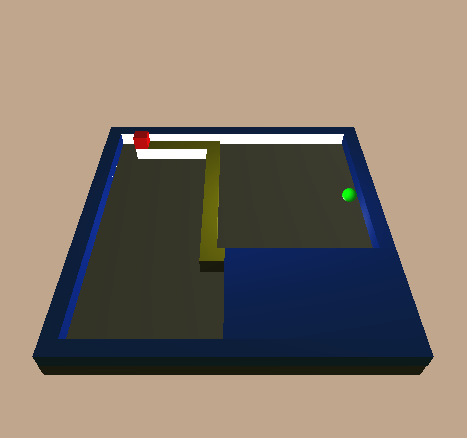

# RG154-flosxonix
3D-верзија игрице "XONIX". Сврха игре је да играч заузме већину територије над платформом где се крећу лоптице. Међутим, играча ометају разне неприлике у разним облицима.
## Усликан екран


Контроле | Опис |
---------| -------- |
<kbd>W</kbd><kbd>A</kbd><kbd>S</kbd><kbd>D</kbd> | мењање смера и правца кретања |
<kbd>SPACE</kbd> | пауза |
<kbd>esc</kbd> | излазак из програма |
<kbd>R</kbd> | ресетовање нивоа |
<kbd>1-9</kbd> | промена нивоа |

## Инсталација
```bash
sudo apt install freeglut3-dev binutils-gold
git clone https://github.com/MATF-RG19/RG2-flosxonix.git
make
./flosXonix
```
